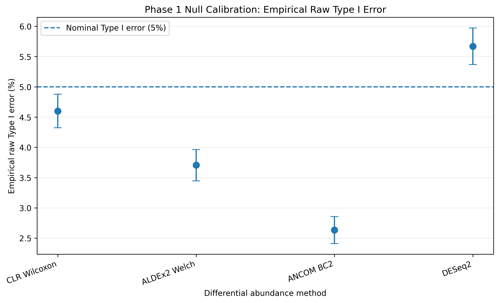
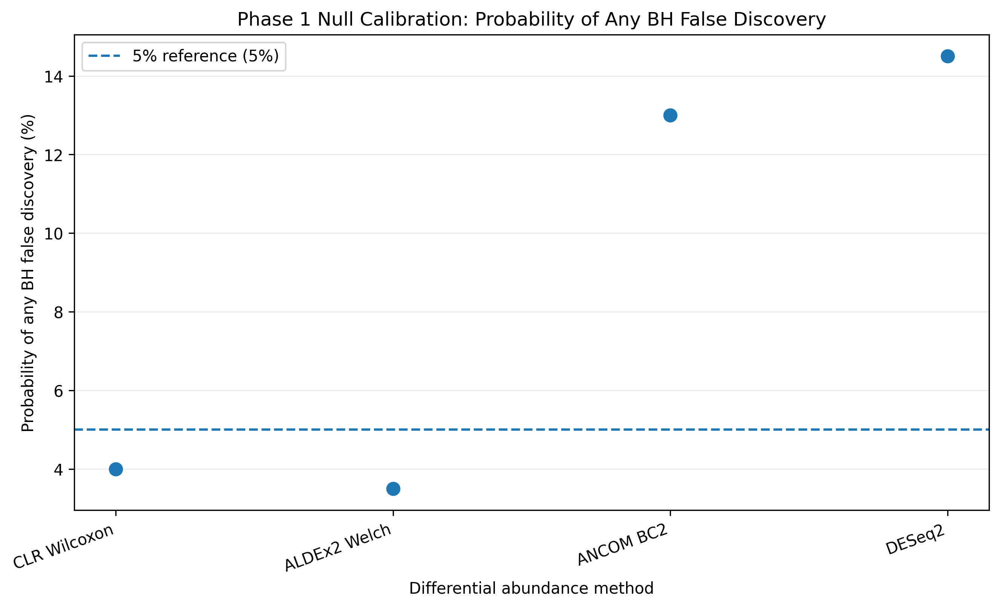
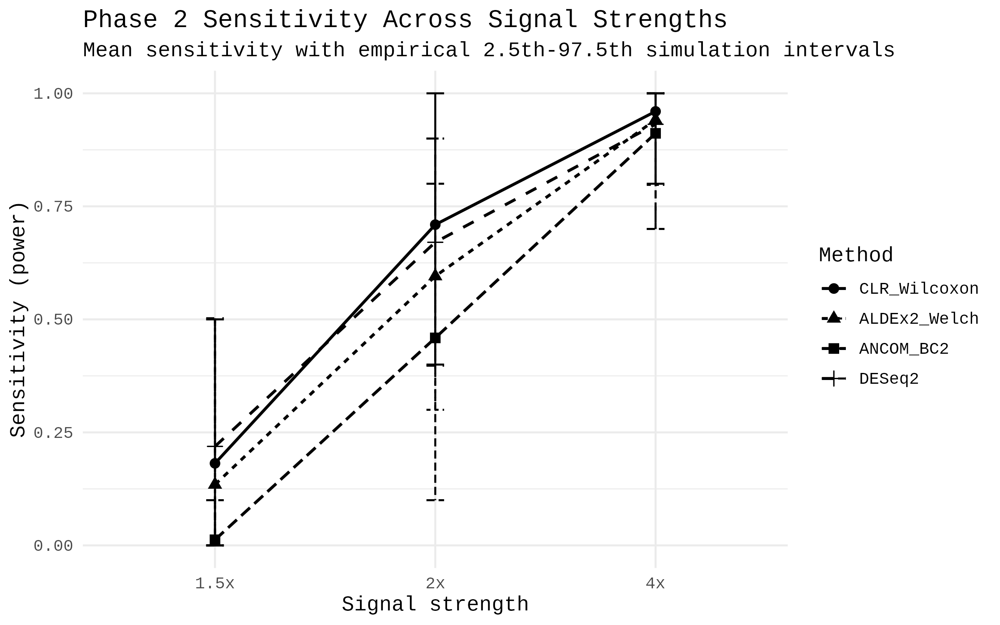
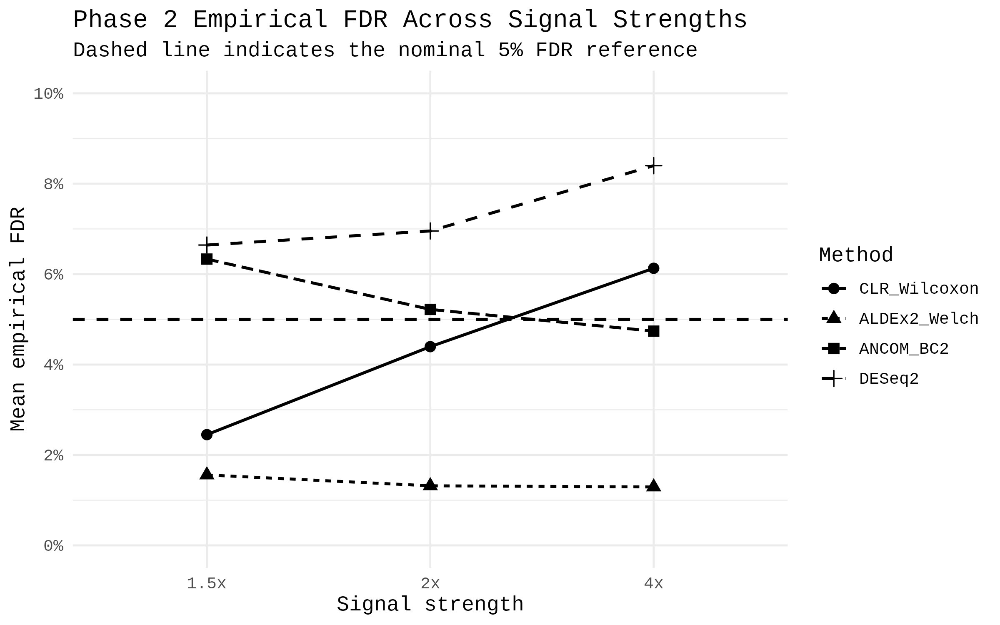
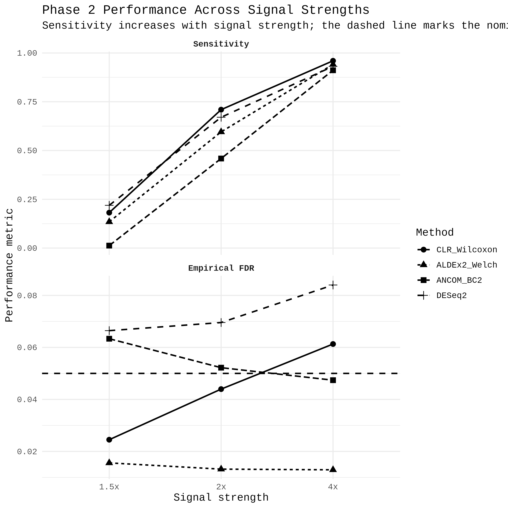

# Analysis Results

This directory contains results generated from the BIOT670I microbiome analyses.
Results may include summary tables, figures, and selected simulation outputs used to evaluate the statistical methods in the project.
Large intermediate files should not be committed unless they are necessary to reproduce or document the analysis.

## Phase 1: Null Calibration

Phase 1 evaluates the statistical pipeline under the null hypothesis, where no true association is present.

### Raw Type I Error

The figure below summarizes the empirical raw Type I error across repeated null simulations. The 5% reference level represents the nominal significance threshold.

### Benjamini-Hochberg False Discovery

The figure below summarizes the probability of observing any false discovery after Benjamini-Hochberg multiple-testing correction across repeated null simulations.

### Phase 1 Summary Data

Numerical null-calibration results are available in:

`phase1_final_calibration_summary.csv`

---

## Phase 2: Signal Simulation

Phase 2 evaluates the statistical methods when known differential-abundance signals are introduced into the simulated microbiome data. Signal strengths of 1.5x, 2x, and 4x were evaluated across repeated simulations using four methods:

- CLR/Wilcoxon
- ALDEx2 Welch
- ANCOM-BC2
- DESeq2

Performance was evaluated primarily using sensitivity and empirical false discovery rate (FDR).

### Sensitivity

Mean sensitivity increased from the 1.5x condition to the 2x condition and again to the 4x condition for all four methods. At the strongest 4x signal, all four methods achieved mean sensitivity above 0.90.

### Empirical False Discovery Rate

The methods differed in their false-discovery behavior across signal strengths.

ALDEx2 Welch remained below the nominal 0.05 FDR reference across all three signal conditions. CLR/Wilcoxon was below 0.05 at 1.5x and 2x and modestly exceeded 0.05 at 4x. ANCOM-BC2 remained close to the 0.05 reference overall. DESeq2 exceeded 0.05 at each evaluated signal strength.

### Combined Performance

The combined performance figure summarizes sensitivity and empirical FDR across signal strengths.

The results illustrate a sensitivity versus false-discovery trade-off rather than a single method dominating under every condition. At weak signal, DESeq2 showed relatively high sensitivity but also higher mean empirical FDR, while ALDEx2 Welch was more conservative and had lower sensitivity. ANCOM-BC2 showed very low sensitivity at the weakest 1.5x signal but improved substantially as the planted effect increased. CLR/Wilcoxon showed strong sensitivity at moderate and strong signals, while its mean empirical FDR increased with signal strength.

These comparisons are descriptive summaries of the simulated conditions used in this project and should not be interpreted as evidence that one method is universally superior.

### Phase 2 Summary Data

Numerical Phase 2 performance results are available in:

`phase2_performance_summary_8F.csv`
